# SoundPose

<div align="center">
  
  
  <p>
    <strong>Transformer-based Quantitative Diagnosis of Voice/Sound Anomalies</strong>
  </p>
  
  <p>
    <a href="#overview">Overview</a> •
    <a href="#key-features">Key Features</a> •
    <a href="#architecture">Architecture</a> •
    <a href="#getting-started">Getting Started</a> •
    <a href="#usage-examples">Usage Examples</a> •
    <a href="#research">Research</a> •
    <a href="#license">License</a>
  </p>
</div>

## Overview

**SoundPose** is a cutting-edge framework that leverages transformer-based architecture to detect, quantify, and diagnose anomalies in voice and sound patterns. Unlike traditional classification approaches, SoundPose employs generative AI techniques to establish a quantitative measure of deviation from normal sound patterns, making it particularly valuable for healthcare diagnostics, mechanical fault detection, and quality assurance applications.

> *This project is based on patent technology developed by Ucaretron Inc.*

<div align="center">
  
</div>

## Key Features

- **Transformer-based Feature Extraction** - Captures complex patterns and long-range dependencies in audio data
- **Quantitative Anomaly Scoring** - Provides numerical measurements of deviation rather than binary classification
- **Personalized Baseline Analysis** - Learns individual normal patterns for more accurate anomaly detection
- **Generative Modeling** - Uses residual loss between real and AI-generated features to score anomalies
- **Multi-domain Spectrum Analysis** - Works with various spectral representations beyond just voice
- **Efficient Processing Pipeline** - Optimized for real-time analysis with minimal computational overhead
- **Healthcare Integration** - Specifically designed for voice-related pathology detection with clinical applications

## Architecture

SoundPose implements a novel approach that differs fundamentally from traditional classification models:

<div align="center">
  
</div>

The system follows a four-stage pipeline:

1. **Audio Input & Preprocessing** - Capture audio and convert to spectral representation
2. **Transformer-based Feature Extraction** - Extract meaningful features using self-attention mechanisms
3. **Anomaly Quantification** - Compute residual loss between actual and generated features
4. **Diagnostic Output** - Provide actionable insights with anomaly scores and visualizations

## Getting Started

### Installation

```bash
# Clone the repository
git clone https://github.com/JJshome/SoundPose.git
cd SoundPose

# Create and activate a virtual environment
python -m venv venv
source venv/bin/activate  # On Windows: venv\Scripts\activate

# Install dependencies
pip install -r requirements.txt

# Install the package in development mode
pip install -e .
```

### Requirements

- Python 3.8+
- PyTorch 1.9+
- Transformers 4.12+
- Librosa 0.8+
- NumPy 1.20+
- Pandas 1.3+
- Matplotlib 3.4+

## Usage Examples

### Basic Usage

```python
from soundpose import SoundPoseAnalyzer

# Initialize the analyzer
analyzer = SoundPoseAnalyzer(model_type='voice')

# Analyze audio file
results = analyzer.analyze_file('path/to/audio.wav')

# Get anomaly score
anomaly_score = results.get_anomaly_score()
print(f"Anomaly Score: {anomaly_score:.2f}")

# Visualize results
results.plot_spectrum_comparison()
```

### Personalized Baseline

```python
from soundpose import SoundPoseAnalyzer, BaselineBuilder

# Create a baseline for an individual
baseline = BaselineBuilder()
baseline.add_recording('baseline1.wav')
baseline.add_recording('baseline2.wav')
baseline.add_recording('baseline3.wav')
baseline.build()

# Initialize analyzer with custom baseline
analyzer = SoundPoseAnalyzer(model_type='voice', baseline=baseline)

# Analyze with respect to personal baseline
results = analyzer.analyze_file('new_recording.wav')
```

### Real-time Monitoring

```python
from soundpose import SoundPoseMonitor

# Setup real-time monitor
monitor = SoundPoseMonitor(threshold=0.75, window_size=2000)

# Start monitoring
monitor.start()

# Stop monitoring after some time
monitor.stop()

# Get monitoring report
report = monitor.generate_report()
```

## Research

Our approach advances beyond existing methods in several key ways:

1. **Feature-based vs. Classification-based**: Traditional approaches cast anomaly detection as a classification problem, requiring large labeled datasets of each anomaly type. SoundPose instead quantifies deviations from learned normal patterns.

2. **Continuous Scoring vs. Binary Detection**: Rather than providing binary yes/no classifications, SoundPose outputs a continuous score that can track subtle changes over time.

3. **Transformer Architecture Advantages**: The self-attention mechanism in transformers is uniquely suited to capture the complex time-frequency relationships in audio spectral data.

4. **Residual Loss Approach**: By comparing generated "expected normal" features with actual features, SoundPose can detect anomalies without explicitly training on anomalous data.

<div align="center">
  
</div>

## Applications

- **Healthcare Diagnostics**: Early detection of voice disorders, vocal fold nodules, paralysis, dysphonia
- **Parkinson's Disease Monitoring**: Track subtle voice changes that may indicate disease progression
- **Industrial Equipment Monitoring**: Detect anomalous sounds in machinery before failure
- **Quality Control**: Ensure consistent audio quality in production environments
- **Security Systems**: Identify unusual audio patterns that may indicate security incidents

## License

This project is licensed under the MIT License - see the [LICENSE](LICENSE) file for details.

## Citation

If you use SoundPose in your research, please cite:

```
@software{soundpose2025,
  author = {Ji-Hwan Jang},
  title = {SoundPose: Transformer-based Quantitative Diagnosis of Voice/Sound Anomalies},
  url = {https://github.com/JJshome/SoundPose},
  year = {2025},
}
```

## Acknowledgements

This work is based on patent technology developed by Ucaretron Inc. for "Quantitative diagnosis method of abnormal behavior based on transformer" (2023).
