# SoundPose

<div align="center">
  
  
  <p>
    <strong>트랜스포머 기반 음성/소리 이상 정량적 진단 시스템</strong>
  </p>
  
  <p>
    <a href="#개요">개요</a> •
    <a href="#주요-기능">주요 기능</a> •
    <a href="#분석-예시">분석 예시</a> •
    <a href="#활용-사례">활용 사례</a> •
    <a href="#시작하기">시작하기</a> •
    <a href="#라이선스">라이선스</a>
  </p>
</div>

## 개요

**SoundPose**는 트랜스포머 기반 아키텍처를 활용하여 음성 및 소리 패턴의 이상을 감지, 정량화, 진단하는 최첨단 프레임워크입니다. 전통적인 분류 접근 방식과 달리, SoundPose는 생성형 AI 기술을 활용하여 정상 소리 패턴에서의 편차를 정량적으로 측정하는 방법을 제공합니다. 이는 의료 진단, 기계 결함 감지, 품질 보증 응용 프로그램에 특히 유용합니다.

> *이 프로젝트는 유케어트론(Ucaretron Inc.)에서 개발한 특허 기술을 기반으로 합니다.*

<div align="center">
  
</div>

## 주요 기능

- **트랜스포머 기반 특징 추출** - 오디오 데이터의 복잡한 패턴과 장거리 의존성을 포착
- **정량적 이상 점수 산출** - 이진 분류 대신 편차의 수치적 측정값 제공
- **개인화된 기준선 분석** - 개인별 정상 패턴을 학습하여 더 정확한 이상 감지
- **생성형 모델링** - 실제와 AI 생성 특징 간의 잔차 손실을 사용하여 이상 점수 산출
- **다중 도메인 스펙트럼 분석** - 음성 외에도 다양한 스펙트럼 표현과 함께 작동
- **효율적인 처리 파이프라인** - 최소한의 계산 오버헤드로 실시간 분석에 최적화
- **의료 통합** - 임상 응용 프로그램을 포함한 음성 관련 병리 감지를 위해 특별히 설계

## 분석 예시

### 1. 음성 건강 상태 분석

다음 시각화는 세 가지 다른 음성 상태(정상, 가벼운 감기, 폐렴)에 대한 SoundPose의 분석 결과를 보여줍니다. 각 상태에 대해 파형과 함께 이상 점수를 표시합니다.

<div align="center">
  
</div>

이 시각화에서 볼 수 있듯이:
- **정상 음성**은 낮은 이상 점수(12%)와 규칙적인 파형을 보입니다.
- **가벼운 감기 음성**은 중간 수준의 이상 점수(47%)와 약간 불규칙한 파형을 보입니다.
- **폐렴 음성**은 높은 이상 점수(83%)와 매우 불규칙한 파형을 보입니다.

### 2. 절삭 공구 상태 분석

산업 환경에서 SoundPose는 기계 장비의 소음을 분석하여 잠재적인 문제를 조기에 식별할 수 있습니다. 아래 시각화는 절삭 공구의 세 가지 상태(정상, 약간 비정상, 심각한 고장)에 대한 노이즈 패턴 분석을 보여줍니다.

<div align="center">
  
</div>

이 시각화에서:
- **정상 상태**는 낮은 노이즈 레벨(8%)과 일정한 패턴을 보입니다.
- **약간 비정상 상태**는 중간 수준의 노이즈 레벨(38%)과 약간의 불규칙성을 보입니다.
- **심각한 고장 상태**는 매우 높은 노이즈 레벨(91%)과 극심한 불규칙성을 보입니다.

> **참고**: 위 시각화는 SoundPose 알고리즘에 의거한 가상적인 상황을 연출한 것으로, 실제 의료 진단이나 기계 진단 목적으로 사용될 수 없습니다.

## 활용 사례

- **의료 진단**: 음성 장애, 성대 결절, 마비, 발성장애 조기 감지
- **파킨슨병 모니터링**: 질병 진행을 나타낼 수 있는 미묘한 음성 변화 추적
- **산업 장비 모니터링**: 고장 전 기계의 이상 소리 감지
- **품질 관리**: 생산 환경에서 일관된 오디오 품질 보장
- **보안 시스템**: 보안 사고를 나타낼 수 있는 비정상적인 오디오 패턴 식별

## 시작하기

### 설치

```bash
# 저장소 복제
git clone https://github.com/JJshome/SoundPose.git
cd SoundPose

# 가상 환경 생성 및 활성화
python -m venv venv
source venv/bin/activate  # Windows: venv\Scripts\activate

# 의존성 설치
pip install -r requirements.txt

# 개발 모드로 패키지 설치
pip install -e .
```

### 요구사항

- Python 3.8+
- PyTorch 1.9+
- Transformers 4.12+
- Librosa 0.8+
- NumPy 1.20+
- Pandas 1.3+
- Matplotlib 3.4+

### 기본 사용법

```python
from soundpose import SoundPoseAnalyzer

# 분석기 초기화
analyzer = SoundPoseAnalyzer(model_type='voice')

# 오디오 파일 분석
results = analyzer.analyze_file('path/to/audio.wav')

# 이상 점수 얻기
anomaly_score = results.get_mean_anomaly_score()
print(f"이상 점수: {anomaly_score:.2f}")

# 결과 시각화
results.plot_spectrum_comparison()
```

### 개인화된 기준선

```python
from soundpose import SoundPoseAnalyzer, BaselineBuilder

# 개인을 위한 기준선 생성
baseline = BaselineBuilder()
baseline.add_recording('baseline1.wav')
baseline.add_recording('baseline2.wav')
baseline.add_recording('baseline3.wav')
baseline.build()

# 사용자 지정 기준선으로 분석기 초기화
analyzer = SoundPoseAnalyzer(model_type='voice', baseline=baseline)

# 개인 기준선에 따른 분석
results = analyzer.analyze_file('new_recording.wav')
```

## 라이선스

이 프로젝트는 MIT 라이선스 하에 있습니다 - 자세한 내용은 [LICENSE](LICENSE) 파일을 참조하세요.

## 인용

연구에서 SoundPose를 사용하는 경우 다음을 인용해 주세요:

```
@software{soundpose2025,
  author = {Jee Hwan Jang},
  title = {SoundPose: 트랜스포머 기반 음성/소리 이상 정량적 진단},
  url = {https://github.com/JJshome/SoundPose},
  year = {2025},
}
```

## 감사의 말

이 작업은 유케어트론(Ucaretron Inc.)에서 개발한 "트랜스포머 기반 비정상 행동의 정량적 진단 방법" (2023) 특허 기술을 기반으로 합니다. SoundPose<sup>TM</sup>는 (주)유케어트론의 상표입니다.